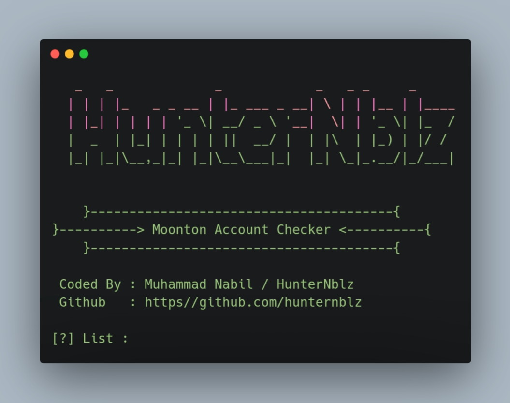

<H1 align="center">
Moonton Account Checker
</H1>

<p align="center">
  <a><br> SCREENSHOT </br></a>
  <br>
  
</p>

## Installation + Usage

```terminal
$ git clone https://github.com/hunternblz/Moonton-Checker.git
$ cd Moonton-Checker
$ php Moonton.php
```
